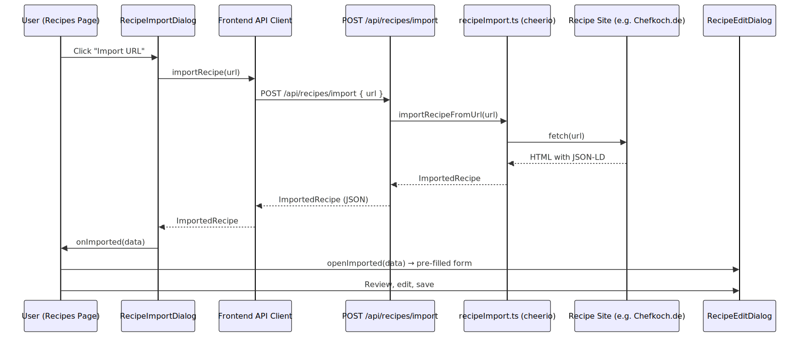

# VorratsCheck

Food storage management: inventory, wishlist, must-have list, recipes, deals, and **categories** — with Express backend, Prisma (SQLite), and Zustand.

## Features

- **Inventory** – Items with name, category (selectable), quantity, expiry date, location; barcode scanner with optional product lookup (Open Food Facts)
- **Must-Have** – Items that should always be in stock (matched by name, optional category)
- **Wishlist** – Entries with name, optional category and brand, and priority (high/medium/low); grouped by priority
- **Recipes** – Recipes with ingredients, instructions, matched against inventory; **URL import** from Chefkoch.de and other sites with Schema.org Recipe markup
- **Deals** – Deals filtered by must-have and wishlist
- **Categories** – Central category management; in inventory, must-have, and wishlist only selectable (no free text)
- **Localization** – UI in German (default) and English; switchable via **Settings → Language**. All user-facing text and dates use the i18n system (`src/app/lib/i18n`).
- **Layout** – Responsive: burger menu (Sheet) on small viewports, horizontal nav from configurable breakpoint (see `src/app/lib/layoutNav.ts`: `LAYOUT_NAV_BREAKPOINT` = sm/md/lg)

### Recipe URL Import

Import recipes from external sites (Chefkoch.de, EatSmarter, etc.) via `POST /api/recipes/import`. The backend fetches the page and prefers structured data from **JSON-LD** (JavaScript Object Notation for Linked Data): many recipe sites embed a Schema.org `Recipe` object in a `<script type="application/ld+json">` block, with fields like `name`, `recipeIngredient`, `recipeInstructions`, `totalTime`, and `recipeYield`. The importer (using cheerio) reads that JSON and returns parsed name, ingredients, instructions, cooking time, difficulty, and servings. The frontend opens a pre-filled edit dialog so the user can review and adjust before saving. If no JSON-LD is present, the importer falls back to HTML parsing (e.g. `og:title`, common ingredient selectors).



## Tech Stack

- **Frontend:** React 18, Vite 6, React Router 7, Tailwind CSS 4, Zustand
- **UI:** Radix UI primitives, Lucide icons (central re-export in `src/app/lib/icons.ts`; import from `@/app/lib/icons`), shadcn-style components in `src/app/components/ui/`
- **Backend:** Express 4, TypeScript (tsx)
- **Database:** Prisma 6, SQLite (dev); PostgreSQL supported for production
- **Auth:** JWT, bcryptjs; token in `Authorization: Bearer <token>` and `localStorage` key `vorratscheck_token`
- **Settings:** Theme (light/dark/system) and locale (DE/EN) in `settingsStore`, persisted to `localStorage` (key `vorratscheck-settings`); theme synced to `next-themes` via `SyncThemeFromStore` in `App.tsx`

## PWA (Progressive Web App)

VorratsCheck can be installed as a Progressive Web App on supported browsers (desktop and mobile, including Android and iOS). The PWA is powered by `vite-plugin-pwa` and provides:

- **Installable app shell** – `display: 'standalone'`, custom theme color, and app icons.
- **Offline-ready static assets** – compiled frontend assets are precached by a generated service worker. API requests still require network connectivity.

### PWA Icons

PWA icons are generated from `public/favicon.svg` into PNG assets:

- `public/pwa-192x192.png`
- `public/pwa-512x512.png`

Generation script (Node + Sharp):

```bash
npm run pwa:icons
```

Run this script whenever you change `public/favicon.svg`. The generated PNGs are committed so that CI/builds do not depend on the script.

## Requirements

- Node.js 18+
- npm

## Setup

1. **Install dependencies**

   ```bash
   npm install
   ```

2. **Environment**

   Create a `.env` file (e.g. copy from `.env.example`). If you already have a `.env`, update `DATABASE_URL` to use the `data/` folder.

   ```bash
   cp .env.example .env
   ```

   Main variables:

   - `DATABASE_URL` – e.g. `file:./data/dev.db`
   - `JWT_SECRET` – secret for JWT (**required** in production; the app warns on startup if the default is used)
   - `INVITE_CODE` – invite code for registration (**required** in production; the app warns if the default is used)

   Optional:

   - `VITE_ORIGIN` – CORS origin (default: `http://localhost:5173`)
   - `PORT` – API server port (default: `3001`)
   - `VITE_API_URL` – API base URL for the frontend (only needed if frontend and API are on different origins, e.g. in production)

3. **Prisma**

   ```bash
   npm run db:generate
   npm run db:push
   npm run db:seed-deals
   npm run db:seed-categories   # requires at least one user
   npm run db:seed-recipes       # requires at least one user
   ```

   Seeds live in `scripts/`. Each seed **overwrites** its data (deletes existing, then inserts defaults). Run `db:seed-categories` and `db:seed-recipes` after at least one user exists (they run per user).

## Development

- **Frontend and backend together:**  
  `npm start`  
  (runs Express and Vite in one terminal via concurrently)

- **Frontend only:**  
  `npm run dev`  
  (Vite with proxy to `http://localhost:3001` for `/api`)

- **Backend only:**  
  `npm run server`  
  (Express on port 3001)

- **Apply schema then start:**  
  `npm run dev:all`  
  (runs `db:push` then `npm start`)

- **Lint:**  
  `npm run lint` / `npm run lint:fix`

- **Storybook:**  
  `npm run storybook`  
  (UI component and page stories at http://localhost:6006)  
  `npm run build-storybook`  
  (static build in `storybook-static/`)

- **Tests (Vitest):**  
  `npm run test`  
  (watch mode)  
  `npm run test:run`  
  (single run; component/unit tests; excludes API integration tests)  
  `npm run test:integration:api`  
  (API integration tests: real API client against test DB; server started automatically; uses `data/test.db`. Tests in `test/integration/api/auth.api.test.ts` and `resources.api.test.ts`; run sequentially via `singleFork` to avoid shared-DB conflicts.)

- **Prisma Studio (DB UI):**  
  `npm run db:studio`  
  (opens database browser at http://localhost:5555)

## Theming and localization

- **Appearance**: User menu (top right) → **Settings** → **Appearance**. Choose light, dark, or system. Preference is stored in `settingsStore` and synced to `next-themes`.
- **Language**: **Settings** → **Language**. Choose German (default) or English. Locale is stored in `settingsStore`; all UI text and dates use `useTranslation()` and `src/app/lib/i18n` (translations in `de.ts`, `en.ts`).
- **Colors**: All theme colors are defined in `src/styles/theme.css`. Edit `:root` for light mode and `.dark` for dark mode; base variables (e.g. `--background`, `--card`) and semantic ones (`--color-success`, `--color-warning`, `--color-danger`, `--color-brand`) are managed there.

## Error Handling

- **Backend**: Routes return errors as `{ error: 'serverErrors.<key>' }`. The `asyncHandler` wrapper in `server/lib/routeHelpers.ts` catches unhandled exceptions and returns a generic `serverErrors.serverError`. For specific, localized errors use `res.status(4xx).json({ error: 'serverErrors.<key>' })`.
- **Frontend API client** (`src/app/lib/api/client.ts`): Translates server error keys (e.g. `serverErrors.invalidUnit`) via `translate()` from the i18n system and throws an `ApiError` with the localized message.
- **CRUD actions** (add/update/delete): Errors are caught in page hooks and shown as toast notifications (`sonner`).
- **Store fetch errors**: The `createResourceStore` catches fetch failures and stores the error message in `store.error`. Each page renders a `<StoreErrorAlert>` (`src/app/components/ui/store-error-alert.tsx`) that displays the error inline when present.
- **Route-level errors**: React Router's `RouteErrorBoundary` (`src/app/components/RouteErrorBoundary.tsx`) catches rendering errors and shows a full-page error UI with reload/home links.

## Production

- **Build frontend:** `npm run build`
- **Backend:** run with `tsx server/index.ts` (or `node --import tsx server/index.ts`). There is no separate server build step.
- **Database:** For production use e.g. PostgreSQL and set `DATABASE_URL` and `provider` in `prisma/schema.prisma`.
- **Environment:** Set `VITE_API_URL` to the public API URL when the frontend is served from another origin so the client can reach the API.

### Security

The server implements the following security measures. Relevant code is commented in the codebase.

| Area | Implementation | Where |
|------|----------------|-------|
| **Authentication** | JWT in `Authorization: Bearer <token>`; algorithm restricted to `HS256`; tokens expire after 7 days. | `server/middleware/auth.ts` (`authMiddleware`, `optionalAuth`, `signToken`) |
| **Secrets** | `JWT_SECRET` for signing/verifying tokens; must be set in production (startup warning if default is used). | `server/middleware/auth.ts` |
| **Passwords** | Bcrypt hashing (cost 10) on signup; constant-time comparison on login. Same error message for unknown user / wrong password to avoid user enumeration. | `server/routes/auth.ts` (login, signup) |
| **Signup restriction** | `INVITE_CODE` required for registration; set a strong value in production (startup warning if default is used). | `server/routes/auth.ts` |
| **Security headers** | `helmet` sets safe HTTP headers (e.g. `X-Content-Type-Options`, `X-Frame-Options`, `X-XSS-Protection`). | `server/app.ts` |
| **CORS** | Allowed origin from `VITE_ORIGIN` (default `http://localhost:5173`). Configure to your exact frontend URL in production. | `server/app.ts` |
| **Body size** | JSON body limit 100 KB to mitigate large-payload DoS. | `server/app.ts` |
| **Rate limiting** | Auth routes (`/api/auth/*`) limited to 20 requests per 15 minutes (express-rate-limit) to mitigate brute-force and credential stuffing. | `server/app.ts` |

**Production checklist:** Set strong `JWT_SECRET` and `INVITE_CODE`; run behind HTTPS (e.g. reverse proxy); set `VITE_ORIGIN` to your frontend origin.

## Project Structure (overview)

- `shared/constants.ts` – Shared constants and types (units, priorities, difficulties, wishlist types, locations); `shared/validation.ts` – Shared validation helpers. Both used by frontend (`@shared/…`) and backend (`../../shared/….js`)
- `src/app/` – React app (pages, components, stores, hooks, lib)
- `src/app/pages/` – Dashboard, Inventory, Must-Have, Wishlist, Recipes, Deals, **Settings** (sub-routes: Categories, Appearance, Language), Login, Signup
- `src/app/components/Layout.tsx` – Header, desktop nav (from breakpoint), mobile burger menu (Sheet), user menu. Uses `useLayout()` and `src/app/lib/layoutNav.ts` (NAV_ITEMS, LAYOUT_NAV_BREAKPOINT, getNavBreakpointClasses).
- `src/app/components/dashboard/` – Dashboard cards: ExpiredItemsCard, ExpiringSoonCard, LowStockCard, QuickActionsCard (import from `../components/dashboard`)
- `src/app/components/deals/` – Deals page UI: DealCard, DealsStats, DealsFilterBar, DealsEmptyState (import from `../components/deals`). Page logic in `useDealsPage()`.
- `src/app/components/inventory/` – Inventory page UI: InventoryItemFormDialog, InventoryItemCard, InventoryFilterBar, InventoryEmptyState (import from `../components/inventory`). Page logic in `useInventoryPage()`.
- `src/app/components/recipe/` – Recipe page UI: RecipeCard, RecipeEditDialog, RecipeListSection, RecipeViewDialog (import from `../components/recipe`)
- `src/app/components/mustHave/` – Must-Have page UI: MustHaveCard, MustHaveStats, MustHaveEmptyState, MustHaveItemDialog (import from `../components/mustHave`). Page logic in `useMustHavePage()`.
- `src/app/components/wishlist/` – Wishlist page UI: WishlistItemDialog, WishlistItemCard, WishlistStats, WishlistPrioritySection, WishlistEmptyState (import from `../components/wishlist`). Page logic in `useWishlistPage()`.
- `src/app/components/settings/` – Settings sub-pages: SettingsCategories, SettingsAppearance, SettingsLanguage (theme and locale).
- `src/app/components/BarcodeScanner.tsx` – Modal scanner; uses `useBarcodeScanner` (start/stop/close, onClose).
- `src/app/stores/` – Zustand stores (Auth, **Settings** (locale, theme), Inventory, MustHave, Wishlist, Recipes, Deals, Categories)
- `src/app/hooks/` – useLayout (header/nav state, logout), useRecipesPage, useInventoryPage, useMustHavePage, useWishlistPage, useDealsPage, useBarcodeScanner (start/stop/close, onClose, elementId)
- `src/app/lib/api/` – API client modules (resource functions per domain, error handling via `ApiError`; entry point `api/index.ts`)
- `src/app/lib/` – Domain/logic: `layoutNav.ts` (NAV_ITEMS, LAYOUT_NAV_BREAKPOINT, getNavBreakpointClasses), **`i18n/`** (useTranslation, t(), formatDate, translations in `de.ts`/`en.ts`), `units.ts`, `recipe.ts`, `mustHave.ts`, `inventory.ts` (INVENTORY_LOCATION_OPTIONS, getExpiryStatus), `productLookup.ts` (barcode → product info, e.g. Open Food Facts)
- `src/styles/theme.css` – **Central theme and colors**: light/dark mode, all CSS variables (`:root` and `.dark`). Edit only this file to change app-wide colors.
- `server/` – Express API: `app.ts` exports the app (used by tests); `index.ts` runs `app.listen()`. Routes, middleware, Prisma under `server/`.
- `prisma/schema.prisma` – Data model (User, Category, InventoryItem, MustHaveItem, WishListItem, Recipe, Deal)

## API (examples)

- `GET /api/health` – Health check (no auth)
- `POST /api/auth/login` – Login (email, password)
- `POST /api/auth/signup` – Sign up (username, email, password, inviteCode)
- `GET/POST/PATCH/DELETE /api/inventory` – Inventory
- `GET/POST/PATCH/DELETE /api/must-have` – Must-have list
- `GET/POST/PATCH/DELETE /api/wishlist` – Wishlist
- `GET/POST/PATCH/DELETE /api/recipes` – Recipes
- `POST /api/recipes/import` – Import recipe from URL (auth required; extracts data via JSON-LD Schema.org)
- `GET /api/deals` – Deals (optional auth: authenticated users see own + seeded deals, unauthenticated see only seeded)
- `POST /api/deals` – Create deal (auth required)
- `DELETE /api/deals/:id` – Delete own deal (auth required)
- `GET/POST/DELETE /api/categories` – Categories

Protected routes require header: `Authorization: Bearer <token>`.

---

For a detailed codebase overview (structure, conventions, API, data model), see [AGENTS.md](./AGENTS.md).
